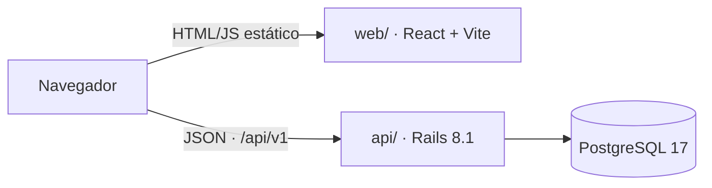

# Biblioteca

Sistema de gestão para a biblioteca de uma escola: acervo, alunos, empréstimos e devoluções com controle de atraso.

Monorepo com dois apps independentes:

| App | Pasta | Stack |
|---|---|---|
| **API** | [`api/`](api) | Ruby 3.4 · Rails 8.1 (modo API) · PostgreSQL 17 |
| **Web** | [`web/`](web) | React 19 · TypeScript · Vite · TanStack Query · React Router · Tailwind CSS |

## Funcionalidades

- **Painel** com exemplares no acervo, disponíveis, empréstimos em andamento e atrasados
- **Livros:** cadastro, edição, exclusão, busca e filtro de disponíveis
- **Alunos:** cadastro, edição, exclusão e busca
- **Empréstimos:** empréstimo com prazo, devolução em um clique e abas por situação (em andamento, atrasados, devolvidos)
- Regras de negócio validadas na API (estoque, duplicidade, exclusões bloqueadas) e exibidas no formulário certo

## Rodando localmente

Só é preciso ter o Docker instalado.

```bash
docker compose up
```

| Serviço | Endereço |
|---|---|
| Web | http://localhost:5173 |
| API | http://localhost:3000/api/v1 |
| PostgreSQL | `localhost:5432` (usuário e senha `postgres`) |

Na primeira execução as dependências são instaladas e o banco é criado com dados de exemplo. Alterações no código recarregam sozinhas nos dois apps.

Também dá para rodar o front-end fora do Docker (com a API rodando via Compose):

```bash
cd web
npm install
npm run dev
```

## Arquitetura



- O front-end é uma SPA estática que conversa com a API por JSON. O CORS da API libera apenas as origens configuradas em `CORS_ORIGINS`.
- O estado do servidor fica no TanStack Query: cada mutação invalida as listas afetadas (um empréstimo atualiza empréstimos e a disponibilidade dos livros).
- Erros de validação da API (`422`) voltam com os erros por campo e aparecem embaixo do campo correspondente no formulário.

Detalhes de endpoints, regras de negócio e modelo de dados estão no [README da API](api/README.md).

## Qualidade

Cada app tem seu próprio workflow no GitHub Actions, disparado só quando a pasta dele muda:

| Workflow | Verificações |
|---|---|
| [API](.github/workflows/api.yml) | Testes (Minitest + PostgreSQL), RuboCop, Brakeman, bundler-audit |
| [Web](.github/workflows/web.yml) | Oxlint, checagem de tipos, testes (Vitest + Testing Library), build |

O Dependabot acompanha gems, pacotes npm e GitHub Actions.

## Deploy

- **Web:** site estático (`npm run build` gera `web/dist`). Pronto para a Vercel; o `web/vercel.json` faz o fallback das rotas da SPA. Configure `VITE_API_URL` com a URL da API.
- **API:** imagem Docker de produção em `api/Dockerfile`, com deploy via [Kamal](https://kamal-deploy.org) ou qualquer serviço que rode containers. Precisa de `DATABASE_URL`, `SECRET_KEY_BASE` e `CORS_ORIGINS`.
