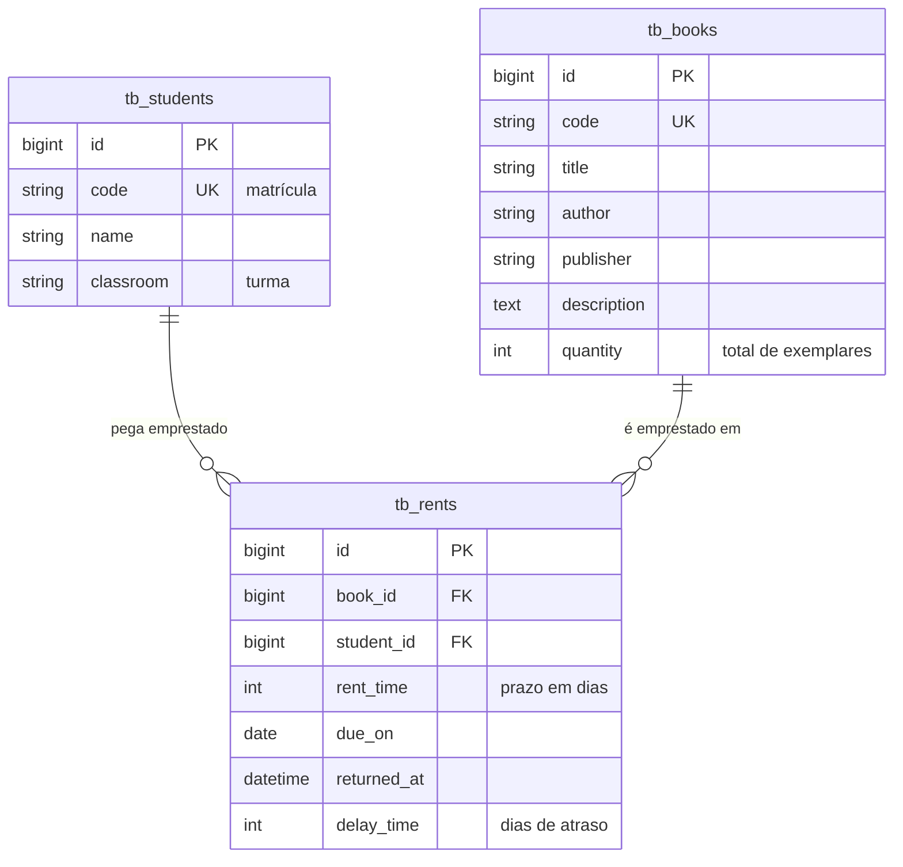

# Biblioteca · API

API em Ruby on Rails para gerenciar a biblioteca de uma escola: acervo de livros, cadastro de alunos e controle de empréstimos e devoluções.

**Stack:** Ruby 3.4 · Rails 8.1 (modo API) · PostgreSQL 17 · Docker · Kamal · GitHub Actions

## Funcionalidades

- **Livros:** CRUD completo, busca por título, autor ou código e filtro de disponíveis
- **Alunos:** CRUD completo e busca por nome, matrícula ou turma
- **Empréstimos:** empréstimo com prazo em dias, devolução, cálculo automático de atraso e filtro por status (`active`, `late`, `returned`)

### Regras de negócio

- `quantity` é o total de exemplares; a disponibilidade (`available`) é calculada a partir dos empréstimos em aberto
- Não é possível emprestar um livro sem exemplares disponíveis, nem emprestar o mesmo livro duas vezes para o mesmo aluno ao mesmo tempo
- O prazo do empréstimo vai de 1 a 30 dias; a data de devolução prevista (`due_on`) é calculada na criação
- Na devolução, os dias de atraso ficam registrados em `delay_time`
- A quantidade de exemplares não pode ficar abaixo do número de exemplares emprestados
- Livros e alunos com histórico de empréstimos não podem ser excluídos
- O empréstimo trava a linha do livro (`SELECT ... FOR UPDATE`), então duas requisições simultâneas não conseguem levar o último exemplar
- Códigos de livro e matrículas de aluno são únicos (sem diferenciar maiúsculas e minúsculas)

## Modelo de dados



## Endpoints

Base: `/api/v1`. Corpo e respostas em JSON.

| Método | Rota | Descrição |
|---|---|---|
| `GET` | `/books?q=&available=true` | Lista livros (busca e filtro opcionais) |
| `GET` | `/books/:id` | Detalhe de um livro |
| `POST` | `/books` | Cria um livro: `{ "book": { "code", "title", "author", "publisher", "description", "quantity" } }` |
| `PATCH` | `/books/:id` | Atualiza um livro |
| `DELETE` | `/books/:id` | Exclui um livro sem empréstimos |
| `GET` | `/students?q=` | Lista alunos |
| `GET` | `/students/:id` | Detalhe de um aluno |
| `POST` | `/students` | Cria um aluno: `{ "student": { "name", "classroom", "code" } }` |
| `PATCH` | `/students/:id` | Atualiza um aluno |
| `DELETE` | `/students/:id` | Exclui um aluno sem empréstimos |
| `GET` | `/rents?status=&student_id=&book_id=` | Lista empréstimos (`status`: `active`, `late` ou `returned`) |
| `GET` | `/rents/:id` | Detalhe de um empréstimo |
| `POST` | `/rents` | Empresta um livro: `{ "rent": { "book_id", "student_id", "rent_time" } }` |
| `PATCH` | `/rents/:id/return` | Registra a devolução |

`GET /up` responde 200 quando a aplicação está no ar (health check).

### Códigos de resposta

| Status | Quando |
|---|---|
| `200` / `201` / `204` | Sucesso |
| `400` | Corpo sem a chave esperada (`book`, `student` ou `rent`) |
| `404` | Registro não encontrado |
| `409` | Exclusão bloqueada por empréstimos vinculados |
| `422` | Erro de validação, com `error` (mensagem) e `details` (erros por campo) |

### Exemplo

```bash
curl -X POST http://localhost:3000/api/v1/rents \
  -H "Content-Type: application/json" \
  -d '{ "rent": { "book_id": 1, "student_id": 1, "rent_time": 7 } }'
```

```json
{
  "id": 5,
  "rent_time": 7,
  "due_on": "2026-10-12",
  "returned_at": null,
  "delay_time": 0,
  "status": "active",
  "days_late": 0,
  "book": { "id": 1, "code": "LIT-001", "title": "Dom Casmurro" },
  "student": { "id": 1, "code": "2025001", "name": "Ana Beatriz Lima", "classroom": "9º A" }
}
```

Mensagens de erro em português:

```json
{ "error": "Livro não tem exemplares disponíveis", "details": { "book": ["não tem exemplares disponíveis"] } }
```

## Rodando localmente

Na raiz do repositório, rode `docker compose up` (veja o [README principal](../README.md)). Isso sobe o PostgreSQL, a API em `http://localhost:3000` e o front-end. Na primeira vez, as gems são instaladas e o banco é criado e populado com dados de exemplo (`db/seeds.rb`).

Comandos úteis:

```bash
docker compose exec api bin/rails console
docker compose exec api bin/rails db:seed:replant   # recria os dados de exemplo
docker compose run --rm -e RAILS_ENV=test api bin/rails test
```

### Variáveis de ambiente

| Variável | Padrão | Uso |
|---|---|---|
| `DB_HOST` / `DB_PORT` / `DB_USERNAME` / `DB_PASSWORD` | `localhost` / `5432` / `postgres` / `postgres` | Conexão em desenvolvimento e teste |
| `DATABASE_URL` | — | Conexão em produção |
| `SECRET_KEY_BASE` | — | Obrigatória em produção |
| `CORS_ORIGINS` | `http://localhost:5173` | Origens liberadas para o front-end, separadas por vírgula |

## Testes e qualidade

30 testes de model e de integração cobrem as regras de negócio e todos os endpoints. A cada push e pull request, o GitHub Actions roda:

- **Testes** contra um PostgreSQL 17
- **Brakeman:** análise estática de segurança
- **bundler-audit:** vulnerabilidades conhecidas nas gems
- **RuboCop** (`rubocop-rails-omakase`): padronização de estilo

O Dependabot mantém gems e Actions atualizadas.

## Deploy

O `Dockerfile` de produção é multi-stage: imagem slim, jemalloc, usuário não-root e o servidor atrás do [Thruster](https://github.com/basecamp/thruster). Ao subir, o container roda `db:prepare` (cria o banco e aplica as migrations).

```bash
docker build -t library_api ./api
docker run -p 80:80 -e DATABASE_URL=postgres://... -e SECRET_KEY_BASE=... library_api
```

O deploy em servidor próprio está preparado com [Kamal](https://kamal-deploy.org) (`config/deploy.yml`).
